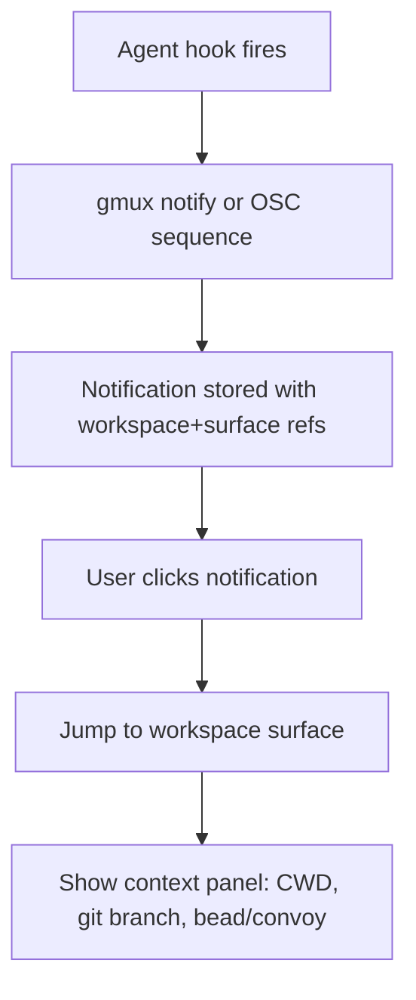
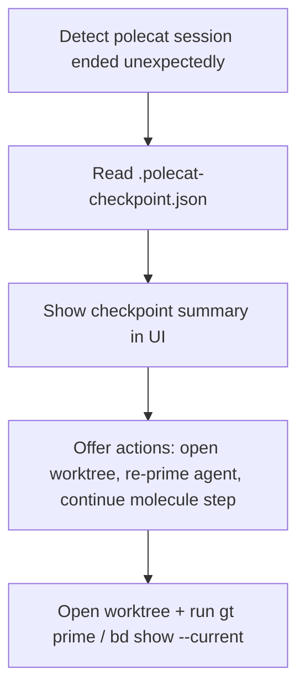
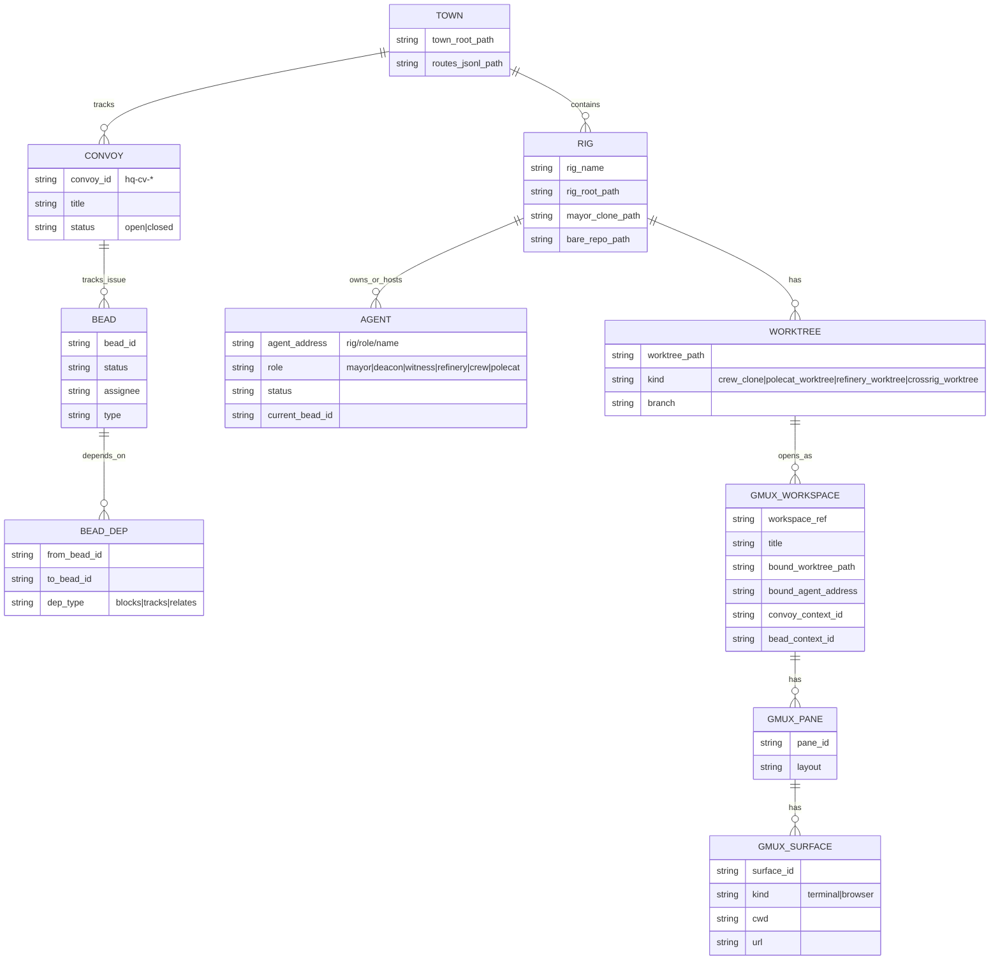

# Gmux PRD Using Working Backwards

## Executive summary

Gmux is a fork of cmux designed to become a **Gastown-native cockpit**: a terminal/browser shell that opens workspaces by **Gastown identity and work state** (rig, crew, polecat, hook, bead, convoy, worktree), rather than by arbitrary filesystem paths. The product intent is “**Superset for Gastown**”: keep the speed, automation, and multi-pane ergonomics of cmux, but make Gastown’s durable work model—Beads ledger + convoys + hooks + role lifecycles—the first-class navigation and status surface. citeturn1search24turn5view2turn9view1turn11view1

**Why this fork is logically coherent**

- **Gastown** positions itself as a multi-agent workspace/orchestration system that solves “agents lose context on restart” by persisting work state in **git-backed hooks** and storing work state in **Beads**. citeturn7search8turn5view2turn11view1  
- **cmux** is explicitly “a primitive” (not prescriptive), offering a native macOS terminal + embedded browser + notifications + a CLI and JSON-RPC socket API for full automation. citeturn6search9turn13view0turn5view4  
- **Superset** (superset-sh) demonstrates a product pattern that users want: parallel isolated workspaces built on git worktrees, agent monitoring, notifications, built-in review/diff, and automated setup scripts. Gmux should borrow the patterns that align, but use Gastown’s beads/convoys/hooks as the source of truth. citeturn2search2turn2search1turn2search9turn2search3

**Critical design constraint: “session persistence”**

cmux users explicitly call out a top gap: cmux can restore UI/session metadata on relaunch, but **live processes (SSH, agents, long-running tasks) are not restored**, which motivates proposals like first-class Zellij integration or named session restore features. citeturn16view0turn16view1turn16view2

Gastown also has its own notion of “checkpointing” for polecat crash recovery, capturing the work state (molecule/step, hooked bead, modified files, branch/commit, timestamp) to `.polecat-checkpoint.json`. That is valuable for Gmux, but it is **not OS-level process checkpoint/restore**. citeturn8view3turn4search0

**Definition of success**

Gmux is successful when it measurably **reduces time-to-context and recovery cost** for a real Gastown Town:

- **Context jump**: “Convoy → correct worker worktree focused with the right panes” in <10 seconds for typical projects (≤20 rigs, ≤30 agents). (Target; measurable via local telemetry; not sourced.)  
- **Recovery**: after app restart, users can resume ongoing work trees (and optionally reattach to multiplexed sessions) with minimal manual re-setup. This is directly aligned with cmux community feature requests and with Superset’s “terminal survives app restarts” philosophy. citeturn16view1turn14view0

**Key licensing implication**

A public Gmux fork must comply with cmux’s licensing: cmux is dual-licensed as GPL-3.0-or-later + commercial, with a recent relicensing note explaining the AGPL→GPL change (still dual-licensed). citeturn6search0turn6search4

Gastown and Beads are MIT-licensed. citeturn7search1turn7search2

**Assumption flagged:** Superset’s licensing appears inconsistent between its docs (claiming Apache 2.0) and its GitHub repository (stating Elastic License 2.0). For this PRD, Superset is treated as a *reference pattern* (conceptual), not a code donor, until licensing is clarified. citeturn7search0turn7search10turn7search7

Also note: Gastown’s GitHub repository appears to be at / redirect to `gastownhall/gastown`; older links (and much discussion) still reference `steveyegge/gastown`. Treat as equivalent project identity for now. citeturn10view1turn6search15

## Working backwards narrative

### Working backwards method alignment

The “Working Backwards” method—popularized inside entity["company","Amazon","tech company"]—centers on writing a future press release and FAQ to force clarity about customer value before implementation. This “PR/FAQ” mechanism is described in Amazon-facing materials and AWS prescriptive guidance that explicitly calls out the press release + FAQ tools as core. citeturn17search1turn17search7

### Press release

**Introducing Gmux: Superset for Gastown**

Today we’re announcing **Gmux**, a desktop cockpit that lets you run and supervise a Gastown Town from one place—without losing the speed and composability of a real terminal. Gmux is built on cmux’s fast terminal/browser primitives and adds Gastown-native views for **rigs, crew workspaces, polecats, beads, hooks, and convoys**. citeturn1search24turn5view2turn9view1turn11view1

When you sling work, track convoys, and coordinate agents, the hard part isn’t “running another terminal.” The hard part is **knowing what needs attention and jumping to the right worktree immediately**, even after restarts or crashes. Gastown already models this with convoys and Beads routing across rigs. Gmux makes that model visible and actionable in a UI that is also fully controllable by automation (CLI + JSON-RPC socket), just like cmux. citeturn9view2turn5view4turn13view0

**Key capabilities**
- Open a workspace by **convoy** (e.g., `hq-cv-*`) and immediately see tracked issues across rigs, progress, and who is working on what. citeturn9view2turn9view1  
- Open by **agent identity** (crew or polecat) and land in the correct directory structure that Gastown defines, with role-specific settings and hooks intact. citeturn8view2turn5view2turn11view1  
- See a Beads-first Kanban and “ready work” panels that reflect Beads’ dependency-aware readiness logic (e.g., `bd ready`) rather than a UI-only task list. citeturn1search7turn1search11turn9view2  
- Persist (or recover) sessions in a transparent, selectable way (metadata restore by default; optional tmux-resurrect, Zellij, or Gastown checkpoint-assisted recovery), addressing the exact gap cmux users highlight (“live processes not restored”). citeturn16view0turn5view3turn8view3

### Customer problem

A Gastown user running multiple rigs and workers experiences three recurring failure modes:

1. **Attention routing breaks**: The operator knows “something landed” or “something is blocked,” but must manually discover which agent/worktree/bead is relevant. Gastown convoys are the batching/tracking unit for cross-rig work, but without a fast cockpit the operator still spends time switching contexts. citeturn9view1turn9view2  

2. **Recovery is costly**: If the terminal app closes, updates, or crashes, re-creating the right set of workspaces/panes/commands is expensive. cmux users explicitly request persistence and named session restore; and separately call out that current cmux relaunch does not restore live processes. citeturn16view1turn16view2turn16view0  

3. **Work state and session state mismatch**: Gastown persists work state in hooks/Beads and can checkpoint polecat “work progress,” but the operator still needs a UI that reconnects durable work state to the actual places they debug, review diffs, and approve merges. citeturn7search8turn8view3turn11view1

### Solution

Gmux provides three layers:

- **Gastown-aware navigation and dashboards**: a Town/Rig/Convoy/Bead/Agent index that matches Gastown’s directory and ID conventions (e.g., `hq-cv-*` convoys; `.beads` routing via `routes.jsonl`; role-based worktree locations). citeturn9view2turn5view2turn5view1  

- **cmux-grade programmable shell**: keeps cmux’s “window → workspace → pane → surface” hierarchy and automation interfaces (CLI, socket API, environment variables, notifications), so both humans and agents can drive Gmux deterministically. citeturn1search24turn5view4turn12view1turn13view2  

- **Session persistence options**: a first-class persistence selector that makes tradeoffs explicit (tmux/tmux-resurrect vs Zellij vs “metadata restore only” vs Gastown checkpoints as “semantic resume”). This is necessary because “true” process checkpoint/restore (e.g., CRIU) is powerful but constrained, often privileged, and OS-specific. citeturn5view3turn3search4turn3search10turn3search2turn8view3

### FAQ

**Who is the customer?**  
Primary: engineers/operators using Gastown daily for multi-agent work at >1 rig scale. Secondary: toolsmiths building agent harnesses and automation on top of cmux-style sockets/CLI and Gastown hooks. citeturn7search8turn5view4turn11view2

**Why not rely on Gastown’s tmux UI?**  
Gastown can run in tmux (“Full Stack Mode” uses tmux; tmux is optional). Gmux targets operators who want a modern native UI and automation, while still allowing tmux integration where it improves persistence. citeturn6search3turn8view2turn5view3

**Is Gmux trying to replace Beads?**  
No. Beads is an agent-optimized ledger with JSON output, dependency tracking, and Dolt-backed persistence; Gmux should consume this as the system of record and avoid duplicating it. citeturn1search7turn6search27turn5view1

**Can Gmux “resume everything exactly as it was”?**  
Not universally. Gmux will support (a) layout/metadata restore, (b) mux-based reattach (tmux/zellij), and (c) semantic resume via Gastown checkpoints; but OS-level checkpoint/restore has limitations and privilege requirements (e.g., CRIU capabilities constraints). citeturn16view0turn3search2turn3search18turn8view3

## Personas and key user journeys

### Primary personas

**Town operator**  
Owns multi-rig health and throughput: monitors convoys, routes work (sling), escalates blocked beads, and wants strong attention routing and auditability. Gastown’s CLI includes convoy dashboards, audit queries by actor, and a Town-level role taxonomy. citeturn9view2turn8view3turn4search20

**Crew developer**  
A human developer operating in a persistent crew workspace (full clone), who sometimes creates cross-rig worktrees using `gt worktree` while keeping identity. They want quick open-by-identity, stable hooks/config, and minimal friction switching between their own work and supervising polecats. citeturn8view2turn4search2turn5view1

**Reviewer / merge gatekeeper**  
Needs a focused view of what landed: convoy progression, file diffs, and confidence gates. Convoys explicitly track batched work, and the mail protocol includes merge-ready / merged message types that support a review and cleanup pipeline. citeturn9view2turn4search1

**Automation/tooling engineer**  
Builds hooks, scripts, and agent harness integrations. Wants deterministic control surfaces (CLI + socket + JSON outputs), and expects “secure by default” local IPC (Unix sockets; file permissions) like cmux and Superset use. citeturn5view4turn14view1turn2search6

### User journeys

**Journey: convoy triage to resolution (operator)**  
- Open Gmux → click “Active Convoys” → identify stranded convoy (ready work, no polecats) → sling or reassign → open the relevant polecat worktree → review changes → mark convoy steps complete. Convoy vs swarm semantics (convoy persistent; swarm ephemeral; stranded convoy needs attention) must be represented explicitly. citeturn9view1turn9view2turn4search1

**Journey: cross-rig fix (crew developer)**  
- In rig A as crew/joe → run `gt worktree beads` to create a worktree in rig B without changing identity → in Gmux, “Open by identity” shows the new cross-rig worktree under rig B → developer works and returns. The directory and identity guarantees come from `gt worktree` docs. citeturn4search2turn4search8turn5view2

**Journey: crash/restart recovery**  
- Operator or crew developer restarts Gmux (quit, update, crash). Gmux should restore layout and bead/convoy context; optionally reattach to persistent mux sessions; and if the agent session crashed, display Gastown checkpoint data (hooked bead, step, dirty files) to resume with minimal re-priming. citeturn16view0turn8view3turn5view3

## Requirements and user stories

### Scope boundaries and consistency checks

**Non-negotiable modeling constraints (must match sources)**

- Rig root is a container (not a clone); `.repo.git` is bare; refinery and polecats are worktrees; mayor’s clone holds canonical `.beads`; settings are placed in parent directories for upward traversal. citeturn5view2turn5view1  
- Crew workspaces are full clones; polecats are witness-managed and ephemeral in session but with persistent sandbox/worktree architecture. citeturn8view2turn5view1turn1search2  
- Convoys are town-level beads (`hq-cv-*`) tracking batched work across rigs; the “tracks” relation is added via Beads dependency edges (because `gt convoy add` is not implemented yet). citeturn9view2turn9view1turn9view2  
- Hooks management is centralized with base + overrides and `gt hooks` tooling; hook mechanisms differ by agent provider (Claude/Gemini settings.json lifecycle hooks; OpenCode plugin; Copilot JSON hooks; “nudge only” fallback for others). citeturn11view1turn11view2  
- cmux provides automation via CLI + a JSON-RPC socket at `/tmp/cmux.sock`; it emits workspace/surface environment variables; notifications can be triggered via OSC or `cmux notify`. citeturn5view4turn13view0turn13view2

### Epics and “complete” user story catalog by release

The table below is intended as a **complete list** for MVP/v1/v2 in this PRD. It is “complete” relative to this document’s stated goals; any additional scope should be treated as a new epic.

**Priority legend**  
- MVP: minimal usable Gmux for daily Gastown operation  
- v1: strong operator workflow, write actions, persistence options  
- v2: deep automation (MCP), multi-profile/team scaling, richer analytics

| Epic | Feature | Priority | User story | Acceptance criteria |
|---|---|---|---|---|
| Town discovery | Detect Town root | MVP | As a user, I want Gmux to detect my Town automatically. | If `gt` is installed, Gmux can locate Town and validate directory structure; if missing, shows actionable requirement list aligned with Gastown install prerequisites. citeturn6search3turn5view2 |
| Town discovery | Rig inventory | MVP | As a user, I want a list of rigs with quick health indicators. | Rigs appear from `~/gt/<rig>/` structure; selecting a rig shows crew/polecats/refinery paths correctly. citeturn5view2turn4search8 |
| Identity navigation | Open crew workspace by name | MVP | As a crew dev, I want “Open joe” and to land in the correct full clone. | For a rig, Gmux opens `crew/<name>/rig/` and indicates “crew = full clone” (not worktree). citeturn8view2turn5view2 |
| Identity navigation | Open polecat by name | MVP | As an operator, I want “Open polecat amber” and see its bead/hook context. | Opens `polecats/<name>/rig/`; shows `.polecat-checkpoint.json` if present; shows hooked bead. citeturn5view2turn8view3 |
| Convoy dashboard | Active convoy list | MVP | As an operator, I want to see active convoys (default attention view). | Uses `gt convoy list`; supports `--all` and `--json`; displays status dots and IDs. citeturn9view1turn9view2 |
| Convoy dashboard | Convoy details view | MVP | As an operator, I want convoy status, progress, tracked issues, and swarm membership. | Uses `gt convoy status <id>` and displays tracked issues and progress; clearly distinguishes convoy vs swarm. citeturn9view1turn9view2 |
| Convoy actions | Add issue to convoy | v1 | As an operator, I want to add a tracked issue to an existing convoy. | Because `gt convoy add` is not implemented, UI uses `bd dep add <hq-cv-id> <issue> --type=tracks` and handles reopening via `bd update --status=open`. citeturn9view2turn9view2 |
| Beads dashboard | “Ready work” view | MVP | As an operator, I want a panel that shows what is ready to work now. | Uses `bd ready` semantics for dependency-aware readiness; refreshed/updated via polling. citeturn1search7turn1search11 |
| Bead detail | Bead inspector | MVP | As a user, I want bead details, deps, and audit trail. | Uses `bd show` including `--current`; renders dependencies, status, and audit trail. citeturn1search3turn1search7 |
| Bead actions | Claim / close / status update | v1 | As an operator, I want to update bead state without leaving Gmux. | Invokes Beads CLI update/close; UI reflects state within polling interval; logs the actor identity. citeturn8view3turn1search7 |
| Hooks management | Hooks status view | MVP | As a toolsmith, I want to see hook targets and sync status. | Uses `gt hooks list --json` for machine-readable output; shows generated targets by role and whether they are in sync. citeturn11view2turn11view1 |
| Hooks management | Edit base/override + sync | v1 | As a toolsmith, I want to open hooks base/override and sync. | Supports `gt hooks base`, `gt hooks override <target>`, and `gt hooks sync` applying merge strategy (base → role → rig+role). citeturn11view1turn11view2 |
| Notifications | Attention routing via cmux-style signals | MVP | As an operator, I want agent notifications to surface with correct context. | Supports OSC-triggered notifications, and a `gmux notify` command equivalent to `cmux notify`; clicking a notification jumps to the originating workspace/surface. citeturn13view0turn13view2 |
| Mail protocol | “Inboxes” panel | v1 | As an operator, I want to see POLECAT_DONE / MERGE_READY / MERGED messages and jump to the provenance. | Parses Gastown mail protocol messages and links to relevant polecat/branch/issue. citeturn4search1turn8view3 |
| Review workflow | Diff and file summary | v1 | As a reviewer, I want to see changed files and diffs quickly per worktree. | Minimum: integrated `git diff` summary; stretch: embed a lightweight diff viewer; must respect worktree identity and branch metadata. citeturn2search2turn3search1 |
| Persistence | Layout + workspace session save/restore | MVP | As a user, I want relaunch restore of my last state; and later named sessions. | MVP: restore last state; v1: named sessions `gmux session save/restore/list/delete` analogous to cmux community proposal. citeturn16view1turn12view1 |
| Persistence | Live process preservation options | v1 | As a user, I want an option that keeps agent/SSH sessions alive across app quit. | Supports configurable mux backends (tmux-resurrect, zellij) with explicit UX and limitations; defaults to safe metadata restore. citeturn16view0turn5view3 |
| Automation | Full CLI surface | v1 | As an automation engineer, I want stable scriptable commands with JSON outputs. | CLI and socket actions cover all UI flows above; commands support `--json` like cmux. citeturn12view1turn5view4 |
| Automation | Socket API extensions | v1 | As a toolsmith, I want JSON-RPC methods/events to drive Gmux. | Implements cmux-like “request per line” JSON-RPC over Unix socket; adds gastown/beads namespaces; emits workspace/convoy/bead update events. citeturn5view4turn14view1 |
| MCP | MCP server for agents | v2 | As an agent runner, I want MCP tools to open workspaces and manage beads/convoys. | Adds an optional MCP server with tools and resources model similar to Superset’s MCP approach and tool examples (`create_workspace`, `click`, `navigate`). citeturn5view5turn2search0 |
| Multi-profile | Separate Town profiles | v2 | As a user, I want multiple local profiles (different Town roots and identities). | Profiles isolate socket paths, caches, and hook edits; avoids cross-contamination of BD_ACTOR/GT_ROLE. citeturn4search2turn8view3 |

## UI/UX flows and wireframe descriptions

### UX principles grounded in source behavior

- Gmux retains cmux’s hierarchy and operands (windows/workspaces/panes/surfaces), because automation and IDs are already centered on that model. citeturn1search24turn12view1  
- Gmux’s primary navigation should be **convoy-first** for operators, because Gastown states convoys are the primary unit for tracking batched work across rigs, and `gt convoy list` is explicitly “the primary attention view.” citeturn9view0turn9view2  
- Gmux must visually distinguish **convoy vs swarm** and surface “stranded convoy” status as an attention condition (ready work, no polecats assigned). citeturn9view1turn9view1

### Mermaid flowcharts

#### Flow: convoy → bead → open correct workspace and worktree

```mermaid
flowchart TD
  A[Select convoy hq-cv-*] --> B[gt convoy status <id> --json]
  B --> C[Pick tracked issue]
  C --> D[bd show <issue> --json]
  D --> E{Assignee/worker known?}
  E -->|Yes| F[Resolve to worktree path (rig/polecats/<name>/rig or crew/<name>/rig)]
  E -->|No| G[Suggest actions: sling / claim / open rig status]
  F --> H[Open or focus Gmux workspace]
  H --> I[Ensure panes: terminal + (optional) browser]
  I --> J[Render bead detail + deps + audit trail]
```

This flow depends on: convoy CLI semantics, Beads detailed introspection (`bd show`), and Gastown’s directory mapping for crew vs polecats. citeturn9view2turn1search3turn5view2turn8view2

#### Flow: “agent needs attention” notification routing



This flow is grounded in cmux’s notification system (OSC + CLI `notify`, plus routing to workspace/surface). citeturn13view0turn13view2

#### Flow: crash recovery using Gastown checkpoint



This flow relies on the documented `gt checkpoint` semantics and stored checkpoint content. citeturn8view3turn4search0

### Mock screen diagrams

#### Mock screen: Town overview with convoys as primary attention view

```
┌───────────────────────────────────────────────────────────────────────┐
│ Gmux — Town Overview                                                   │
├───────────────┬───────────────────────────────────────────────────────┤
│ Sidebar       │ Active Convoys (gt convoy list)                        │
│               │                                                       │
│ Town          │ ● hq-cv-abc  Deploy v2.0     2/4 done   stranded: no    │
│  ▸ Rigs        │ ● hq-cv-w3n  Feature X      0/3 done   stranded: yes   │
│  ▸ Convoys     │                                                       │
│  ▸ Agents      │ Selected: hq-cv-w3n                                    │
│               │ Tracked Issues:                                         │
│ Rig: gastown  │  ○ gt-frontend-abc  [task]  assignee: none              │
│  ▸ Beads       │  ○ gt-backend-def   [task]  assignee: none              │
│  ▸ Worktrees   │  ○ bd-docs-xyz      [task]  assignee: none              │
│               │ Actions: [Sling...] [Open Rig Status] [Open Bead]       │
└───────────────┴───────────────────────────────────────────────────────┘
```

“Stranded convoy” is a first-class concept in convoy docs, and `gt convoy list` is defined as the dashboard / attention view. citeturn9view1turn9view2

#### Mock screen: Rig view showing crew vs polecats and hooks status

```
┌───────────────────────────────────────────────────────────────────────┐
│ Rig: beads                                                             │
├───────────────┬───────────────────────────────────────────────────────┤
│ Crew (clones) │ Worktrees / Workers                                    │
│  - joe        │ Polecats (worktrees):                                  │
│  - emma       │  - amber  [working]  hooked: bd-abc...                 │
│               │  - nux    [idle]     last: bd-def...                   │
│ Hooks         │ Refinery (worktree): rig/ on main                       │
│  - base OK    │                                                       │
│  - overrides  │ Hook targets (gt hooks list):                           │
│               │  crew/.claude/settings.json     ✓ synced                │
│               │  polecats/.claude/settings.json  ✓ synced               │
│               │  refinery/.claude/settings.json  ! diff                 │
└───────────────┴───────────────────────────────────────────────────────┘
```

Crew vs polecat lifecycle is specified in `gt crew` docs and in Gastown architecture/reference docs; hooks list/diff/sync are documented under `gt hooks`. citeturn8view2turn5view1turn11view2

#### Mock screen: Workspace bound to a polecat worktree with bead detail

```
┌───────────────────────────────────────────────────────────────────────┐
│ Workspace: beads/polecat/amber                                         │
├───────────────┬───────────────────────────────────────────────────────┤
│ Context       │ Terminal (surface: terminal)                           │
│ Bead: bd-abc  │ ~/gt/beads/polecats/amber/rig                          │
│ Convoy: hq-.. │ ❯ bd show --current --json                             │
│ Status: open  │ ❯ git status                                           │
│ Checkpoint:   │ ❯ gt checkpoint read                                   │
│  step: 3/7    │                                                       │
│ Modified: 2   │ Browser (surface: browser)                             │
│ Actions:      │ http://localhost:3000                                  │
│ [Notify]      │                                                       │
│ [Mark ready]  │                                                       │
└───────────────┴───────────────────────────────────────────────────────┘
```

This binds together: polecat worktree paths and checkpoint storage location, Beads “current issue” rendering, and cmux-style surfaces (terminal/browser) with automation. citeturn5view2turn8view3turn1search3turn1search24

## Data model and control surfaces

### Concept mapping and consistency notes

Gastown has concrete filesystem and ID conventions that must map deterministically into the cmux workspace hierarchy.

Key grounded facts:

- **Worktree layout**: polecats and refinery are git worktrees based off `mayor/rig`; crew workspaces are full clones. citeturn5view1turn8view2  
- **Beads routing**: bead IDs route across rigs using prefix mappings in `~/gt/.beads/routes.jsonl` pointing to `mayor/rig` where the canonical `.beads` lives. citeturn5view1turn5view2  
- **Convoys**: live in town-level beads (`hq-cv-*`) and track issues across rigs; status is retrieved via `gt convoy status`; list supports `--json`. citeturn9view2turn9view1  
- **Hooks**: base+overrides system with `gt hooks list/diff/sync/scan/init`, and hook mechanisms vary by agent provider. citeturn11view1turn11view2  
- **cmux model**: window → workspace → pane → surface, with a CLI and a socket API used to create/select/rename workspaces and target surfaces; environment variables include `CMUX_WORKSPACE_ID`, `CMUX_SURFACE_ID`, and `CMUX_SOCKET_PATH`. citeturn1search24turn12view1turn5view4

**Design assumption flagged:** Whether Gmux should adopt Superset’s internal “workspace = one branch + dedicated port ranges” concept directly is unspecified. Superset documents dedicated port ranges per workspace; Gastown documents worktrees and role-based directories but not a standardized port allocation scheme. citeturn2search1turn5view2

### Proposed entity model (mermaid ER diagram)



This ER model encodes the hard constraints that convoys are `hq-cv-*` beads and that “tracks” is modeled as a dependency edge (because convoy add is implemented via Beads deps today). citeturn9view2turn9view1

### API/CLI surface design

#### Compatibility and naming constraints

Gmux should preserve cmux’s existing automation posture:

- CLI is a wrapper around a Unix socket control plane. citeturn5view4turn12view1  
- Socket protocol is JSON-RPC over a Unix domain socket (cmux’s default: `/tmp/cmux.sock`). citeturn5view4turn14view1  
- Entities are identified both by user-friendly refs (`workspace:1`) and UUIDs; JSON outputs support both patterns. citeturn12view1turn12view0

Proposed Gmux deltas:

- Default socket path `/tmp/gmux.sock` (assumption; must be confirmed in implementation).  
- Environment variables: `GMUX_WORKSPACE_ID`, `GMUX_SURFACE_ID`, `GMUX_SOCKET_PATH` (mirroring cmux). citeturn5view4  

#### CLI command catalog

A minimal but complete catalog (for this PRD) is below. All commands must support `--json` where output is non-trivial, following cmux’s conventions. citeturn12view1turn13view2

**Workspace control (inherits from cmux)**
- `gmux list-workspaces --json`
- `gmux new-workspace --cwd <path> --command <cmd>`
- `gmux select-workspace --workspace <id|ref|index>`
- `gmux close-workspace --workspace <id|ref|index>`
- `gmux notify --title ... --workspace ...` (cmux-compatible semantics) citeturn12view1turn13view2

**Gastown-native commands**
- `gmux convoy list [--all] [--status=open|closed] --json` (wraps `gt convoy list`) citeturn9view2  
- `gmux convoy status <hq-cv-id> --json` (wraps `gt convoy status`) citeturn9view2  
- `gmux convoy open <hq-cv-id> [--focus]` (UI action)  
- `gmux bead show <id> --json` (wraps `bd show`) citeturn1search3  
- `gmux bead ready --json` (wraps `bd ready`) citeturn1search7  
- `gmux agent open <rig>/<role>/<name>` (resolves worktree path via Gastown reference layout) citeturn5view2turn8view2  
- `gmux hooks list --json` (wraps `gt hooks list --json`) citeturn11view2

#### Socket API

Base: cmux-style JSON-RPC requests per line, `ok/result` responses. citeturn5view4turn14view1

Proposed method namespaces:

- `workspace.*`, `pane.*`, `surface.*`, `notification.*` (inherit)  
- `gastown.convoy.list`, `gastown.convoy.status`, `gastown.rig.list`, `gastown.agent.list`  
- `beads.bead.show`, `beads.bead.ready`, `beads.bead.update`, `beads.bead.close`  
- `gmux.open.by_convoy`, `gmux.open.by_agent`, `gmux.open.by_bead`

**Example request/response JSON**

```json
{"id":"req-42","method":"gmux.open.by_convoy","params":{"convoy_id":"hq-cv-abc12","focus":true}}
```

```json
{
  "ok": true,
  "result": {
    "workspace_ref": "workspace:4",
    "workspace_id": "550e8400-e29b-41d4-a716-446655440000",
    "convoy_id": "hq-cv-abc12",
    "opened": ["terminal", "convoy_panel", "bead_panel"]
  }
}
```

The response structure is aligned to cmux CLI JSON patterns where refs/UUIDs are returned in structured form. citeturn12view1turn13view2

**Socket events**

Because Gastown and Beads are primarily CLI-driven, Gmux must choose between polling, file watching, and event streams.

- Gastown has an activity feed mechanism that writes events to `~/gt/.events.jsonl` and is viewable with `gt feed`. This can be used as an event substrate if stable. citeturn8view3  
- Superset’s persistence daemon deep dive highlights protocol concerns like backpressure and suggests NDJSON over Unix sockets with careful separation of RPC vs stream sockets. This is highly relevant for a future Gmux “terminal daemon” track, but is not required for MVP. citeturn14view1turn14view0

#### MCP mappings

Superset’s docs describe a built-in MCP server, and its API docs enumerate packages that implement MCP and desktop automation MCP, with example tools like `create_workspace`, `click`, and `navigate`. citeturn2search0turn5view5

For Gmux v2, MCP should be a thin mapping over the socket API:

- Tools:
  - `open_convoy`, `get_convoy`, `list_convoys`
  - `open_bead`, `get_bead`, `list_ready_beads`
  - `open_agent_workspace`, `list_agents`
  - `notify_attention`, `list_notifications`
- Resources:
  - `town_state`, `rig_state`, `workspace_topology`

**Assumption flagged:** Specific MCP transport and schema details are not standardized in the cited Superset docs beyond tool/resource/prompt framing and example tool names; Gmux must pick a concrete MCP SDK/transport in implementation. citeturn2search0turn5view5

## Integration, persistence, security, and delivery plan

### Integration plan with Gastown and Beads

#### Primary integration approach: CLI-first with JSON outputs

Gastown’s documentation shows that many commands support `--json`, including convoy list and `gt audit`. Convoy list explicitly supports `--json`. citeturn9view2turn8view3

Beads is described as agent-optimized with JSON output, dependency tracking, and `bd ready`; and `bd show` provides detailed issue information including full audit trail. citeturn1search7turn1search3turn6search27

Therefore:

- Gmux should treat `gt` and `bd` as systems of record and use their JSON outputs wherever possible.  
- When a capability is “not yet implemented” in `gt` (e.g., `gt convoy add`), Gmux should use the documented workaround (`bd dep add ... --type=tracks`). citeturn9view2

#### Path resolution and identity correctness

Gmux must implement deterministic mapping using Gastown reference and workspace docs:

- Rig root is not a clone; worktrees and clones live inside. citeturn5view2  
- Polecat worktrees are under `<rig>/polecats/<name>/rig/` and share role-level `.claude/settings.json` in the polecats parent directory. citeturn5view2turn11view1  
- Crew is persistent and user-managed; crew workspaces are full clones. citeturn8view2turn5view1  
- Cross-rig worktrees created by `gt worktree` are placed under the target rig’s `crew/` directory with a combined name and preserve identity (BD_ACTOR and GT_ROLE). citeturn4search2turn4search8  

**Consistency rule:** classify worktree kind by inspecting git metadata (`.git` file vs directory) rather than only by path, because git worktrees often have a `.git` file that points to the shared gitdir. citeturn3search1turn3search25

### Session persistence strategy

This PRD distinguishes four kinds of “persistence,” which users often conflate:

1. **UI layout persistence**: restore windows/workspaces/panes and their CWDs.  
2. **Terminal session persistence**: keep PTYs alive across app restarts.  
3. **Work-state persistence**: keep “what to do next” durable (beads/hooks).  
4. **OS-level process checkpoint/restore**: snapshot memory/process tree (CRIU-like).

cmux issues show that lack of “live terminal process restore” is a major pain. citeturn16view0turn16view2

Gastown provides work-state persistence (hooks + beads) and semantic checkpoints for polecat crash recovery. citeturn7search8turn8view3

#### Tradeoff table

| Approach | What it preserves | Strengths | Weaknesses | Source grounding |
|---|---|---|---|---|
| “Metadata restore” (layout/CWD/URLs) | Workspace/pane layout; CWD; browser URLs; scrollback snapshots | No extra deps; portable | Does not keep long-running processes alive | cmux users request more; current gap described explicitly citeturn16view0turn16view2 |
| tmux + tmux-resurrect | tmux sessions/windows/panes, CWDs, layouts; can restore programs with strategies | Mature ecosystem; explicit save/restore keys; works on macOS/Linux | Requires tmux and plugin config; “program restore” is best-effort | tmux-resurrect README details scope and key binds citeturn5view3 |
| tmux + tmux-continuum | Adds periodic save and auto-restore on tmux server start | Reduces “forgot to save” failure | Still depends on tmux server lifecycle; restore timing is tmux-server-start only | tmux-continuum docs citeturn3search4 |
| Zellij integration | Detach/reattach with built-in session persistence | Proposed for cmux because it targets the “live processes not restored” gap | Integration effort; platform/support tradeoffs | cmux issue proposes Zellij as solution; defines semantics for detach/reattach citeturn16view0 |
| Superset-style terminal daemon | PTYs live in a separate daemon; app reconnects; cold restore from disk | No tmux dependency; protocol-level backpressure handling | Implementation complexity (daemon lifecycle, protocol versioning) | Superset blog dissects daemon design and NDJSON-over-sockets protocol citeturn14view0turn14view1 |
| Gastown `gt checkpoint` | Semantic checkpoint (molecule/step, bead, modified files, branch/commit) | Useful for crash recovery even if PTY dies | Not process persistence; requires “resume flow” UX | Gastown diagnostics docs specify stored data and file location citeturn8view3 |
| CRIU checkpoint/restore | Process tree state to files; restore later | Most complete in theory | Linux-specific; privilege/capability limitations; cannot checkpoint many cases; operationally heavy | CRIU man page + docs describe purpose and limitations/capabilities citeturn3search10turn3search2turn3search18 |

#### Recommended plan for Gmux

**MVP**
- Implement robust **workspace layout persistence** and **named sessions** (a direct extension of cmux’s requested feature set: save/restore named workspace sessions). citeturn16view1turn12view1  
- Introduce “semantic resume” overlays powered by `gt checkpoint read`. citeturn8view3  

**v1**
- Add optional “Persistent Terminal Mode” per workspace:
  - **tmux-resurrect** guided setup (documented as “no config required,” but in practice many users will configure program strategies; treat program restore as best-effort). citeturn5view3turn3search4  
  - **Zellij experimental** track if it aligns with cmux community direction. citeturn16view0

**v2**
- Evaluate a Superset-like daemon architecture only if persistence requirements exceed what tmux/Zellij deliver, because daemon design adds protocol complexity (backpressure, head-of-line blocking, version negotiation). citeturn14view1turn14view0  

### Security, auth, and multi-user considerations

#### Local IPC and automation security

- cmux’s integration docs describe the socket API as a Unix domain socket and include security considerations; Unix sockets inherit filesystem permission semantics, commonly used for local secure IPC. citeturn5view4turn14view1  
- Superset’s daemon design explicitly argues Unix sockets are “fast” and “secure” due to file permissions. citeturn14view1  

**Requirement:** Gmux must:
- create its socket in a user-owned path with restrictive permissions,  
- support explicit “automation mode” toggles for high-risk actions (e.g., executing shell commands),  
- log all externally triggered actions to a local audit log, optionally aligning to Gastown’s `gt audit` and event feed semantics. citeturn8view3turn5view4  

#### Authentication surfaces

Gmux should not become its own auth system. It should rely on:
- git credentials as configured by the user’s environment,  
- agent CLI credentials (Claude Code, Copilot, etc.) as managed by those tools,  
- Beads/Dolt remotes as configured by Beads. citeturn6search3turn6search27  

#### Multi-user and profile support

Gastown emphasizes identity and attribution (actor-based audit queries exist), and cross-rig worktrees preserve identity variables. citeturn8view3turn4search2  

**v2 requirement:** Support local profiles (Town roots + identity) and ensure profile switching cannot leak hooks configs or cached `bd` results across profiles.

### Deployment, packaging, contributor guide

#### Repo and license posture

- Forking cmux publicly implies GPL compliance under cmux’s dual-license model; and cmux’s license file explicitly states GPL-3.0-or-later + commercial. citeturn6search0turn6search4  
- For contributors, packaging must preserve GPL notices and source availability for distributed binaries.

#### Build and packaging (derived from cmux)

cmux’s contributing docs specify a setup script that initializes submodules, builds GhosttyKit, and provides a reload script to run the debug app. citeturn6search5turn6search1  

cmux’s integration docs specify the bundled CLI binary path inside the app, and cmux CLI reference notes the CLI is bundled and installed to `/usr/local/bin/cmux` on first launch. citeturn5view4turn1search1  

**Gmux packaging requirements**
- `Gmux.app` bundles `gmux` CLI in app resources.  
- First launch prompts (or auto-installs) a symlink to `/usr/local/bin/gmux` (mirroring cmux). citeturn1search1  
- `gmux` CLI supports JSON outputs and maps 1:1 to socket methods (like cmux). citeturn12view1turn5view4  

**Contributor guide “must haves”**
- “How to run against a real Town” dev setup (requires gt/bd installed; can point at a sample Town tree). Gastown install docs enumerate prerequisites including Go, Git, Dolt, Beads, and optional tmux. citeturn6search3  
- Contract tests for CLI JSON outputs (fixtures for `gt convoy list --json`, `gt hooks list --json`, `bd show --json`). citeturn9view2turn11view2turn1search7  
- UI test harness focused on deterministic automation flows (cmux’s own roadmap materials emphasize standardizing socket semantics and UI automation). citeturn1search4turn1search23  

**Repository hosting**  
If hosted on entity["company","GitHub","code hosting platform"], ensure CI covers: formatting, build, unit tests, and JSON contract tests (standard; proposed).

### Roadmap, milestones, effort estimates, risks

#### Feature matrix summary

| Capability | cmux baseline | Gastown baseline | Superset baseline | Gmux intended |
|---|---|---|---|---|
| Programmable terminal shell (CLI + socket) | Yes (CLI + JSON-RPC socket, env vars) citeturn5view4turn12view1 | N/A | MCP server exists (built-in) citeturn2search0turn5view5 | Yes (inherit + extend) |
| Convoy tracking UI | No | Yes (convoys are the tracking unit; CLI dashboard) citeturn9view1turn9view2 | Task/workspace tracking (not convoy model) citeturn2search2turn2search1 | Yes (first-class) |
| Beads-first task graph | No | Yes (Beads routing and integration) citeturn5view1turn5view0 | Conceptual tasks; not Beads | Yes (Beads as system-of-record) citeturn1search7 |
| Hooks management | Partial (agent integration docs) citeturn5view4 | Yes (`gt hooks` system, base/overrides) citeturn11view1turn11view2 | Notification hooks and presets citeturn2search3turn2search9 | Yes (visual and action-oriented) |
| “Terminal survives restarts” | Not for live processes (known gap) citeturn16view0 | tmux optional full-stack; semantic checkpointing citeturn6search3turn8view3 | Yes via daemon architecture (per blog) citeturn14view0 | Optional (mux backends + semantic resume) |

#### Milestones and estimates (person-weeks)

These estimates assume one senior engineer familiar with macOS + Swift + IPC and one part-time designer for MVP. (Proposed; not sourced.)

| Milestone | Deliverables | Est. effort |
|---|---|---:|
| MVP | Town/rig discovery, convoy list/status UI, bead inspector + ready view, open-by-agent, hooks list view, notification routing, basic persistence (restore last session) | 10–14 |
| v1 | Bead write actions, convoy add via `bd dep add`, hooks edit/sync integration, inbox mail protocol panel, named sessions, persistent terminal mode (tmux-resurrect) | 16–24 |
| v2 | MCP server + tool schemas, multi-profile, zellij experimental mode, richer analytics from `gt audit` and event feed, optional daemon track feasibility study | 20–30 |

#### Risks and mitigations

**Risk: CLI output instability / missing JSON in some commands**  
Mitigation: hard-require JSON mode for the exact commands UI depends on (`gt convoy list/status --json`, `gt hooks list --json`) and maintain compatibility tests against fixtures. Convoy list JSON is explicitly documented, as is hooks list JSON. citeturn9view2turn11view2

**Risk: Mis-modeling convoy editing**  
Mitigation: treat `gt convoy add` as unavailable and use the documented Beads dependency approach (`tracks` relation). citeturn9view2

**Risk: Persistence expectations vs feasible implementation**  
Mitigation: expose persistence as an explicit mode with clear UX explanation. Use tmux-resurrect/continuum for best-effort “program restore,” use Gastown checkpoints for semantic resume, avoid promising CRIU-class checkpointing on macOS. citeturn5view3turn8view3turn3search10turn3search2

**Risk: “Superset-like” features creep**  
Mitigation: keep Gmux anchored to Gastown’s model. Borrow Superset concepts only where they map cleanly: setup scripts and notification hooks patterns. Superset documents setup scripts in `.superset/config.json`; Gmux should add an analogous config file but not recreate Superset’s entire desktop feature set. citeturn2search9turn2search3turn2search1

**Risk: License confusion around Superset**  
Mitigation: treat Superset purely as a product reference and avoid code reuse until resolved; the Superset repo states ELv2 while docs state Apache 2.0—this must be reconciled before depending on its code or docs as binding. citeturn7search0turn7search7turn7search10

### Reference index

```text
Primary sources used
- Gastown docs: https://docs.gastownhall.ai/
  - Convoys: https://docs.gastownhall.ai/concepts/convoy/
  - Reference (directory): https://docs.gastownhall.ai/reference/
  - Workspace commands: https://docs.gastownhall.ai/usage/workspace/
  - Diagnostics (checkpoint, audit): https://docs.gastownhall.ai/usage/diagnostics/
  - Mail protocol: https://docs.gastownhall.ai/design/mail-protocol/
  - Architecture: https://docs.gastownhall.ai/design/architecture/

- Gastown repo: https://github.com/gastownhall/gastown
  - HOOKS.md: https://github.com/gastownhall/gastown/blob/main/docs/HOOKS.md

- Beads repo: https://github.com/steveyegge/beads
  - Agent workflow docs: https://mintlify.com/steveyegge/beads/guides/agent-workflow
  - bd show: https://mintlify.com/steveyegge/beads/cli/show

- cmux docs/repo: https://github.com/manaflow-ai/cmux
  - Concepts: https://cmux.com/docs/concepts
  - Custom agent integrations: https://www.mintlify.com/manaflow-ai/cmux/integrations/custom-agents
  - CLI workspaces: https://manaflow-ai-cmux.mintlify.app/cli/workspaces
  - Notifications: https://www.mintlify.com/manaflow-ai/cmux/features/notifications
  - cmux persistence gap discussions: https://github.com/manaflow-ai/cmux/issues/1663

- tmux-resurrect / continuum
  - https://github.com/tmux-plugins/tmux-resurrect
  - https://github.com/tmux-plugins/tmux-continuum

- Git worktree docs (primary)
  - https://git-scm.com/docs/git-worktree
  - https://git-scm.com/docs/gitrepository-layout

- Process checkpoint/restore references
  - CRIU man page: https://manpages.debian.org/unstable/criu/criu.8.en.html
  - CRIU docs: https://github.com/checkpoint-restore/criu/blob/criu-dev/Documentation/criu.txt
  - CRIU limitations: https://criu.org/What_cannot_be_checkpointed

- Working backwards / PRFAQ methodology sources
  - About Amazon: https://www.aboutamazon.com/news/workplace/an-insider-look-at-amazons-culture-and-processes
  - AWS prescriptive guidance: https://docs.aws.amazon.com/prescriptive-guidance/latest/strategy-product-development/start-with-why.html
```